# W5 Network Fortress - Evidence Pack

## 1. Thông tin chung (Cover)
* **Thành viên:** Nguyễn Công Thịnh
* **Repository Link:** [Link repo của bạn]


---

## 1.1. Sơ đồ Kiến trúc Hệ thống (Architecture Diagram)

Dưới đây là sơ đồ chi tiết kiến trúc bảo mật **W5 Network Fortress** của hệ thống đã triển khai.

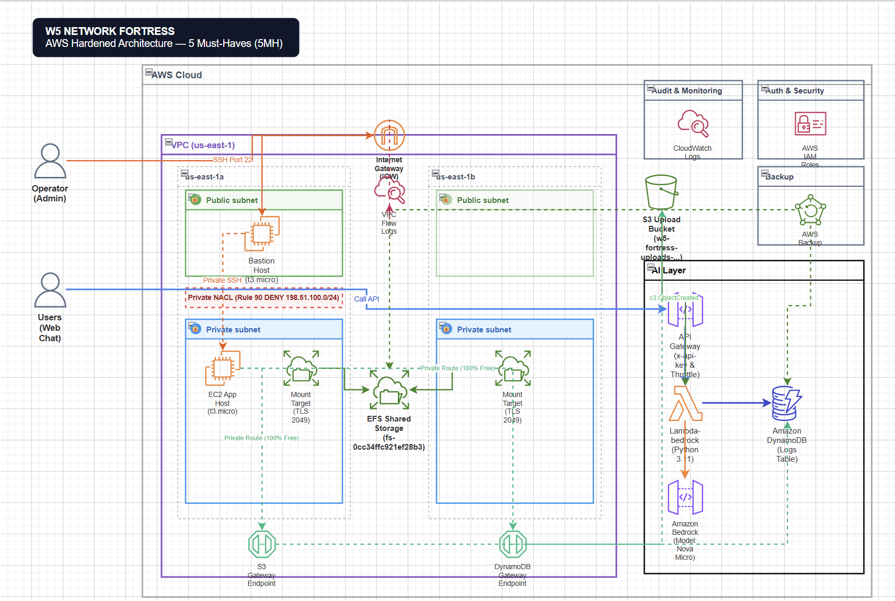

---

## 2. MH1 — Multi-VPC Connectivity (Lựa chọn & Rationale)
Nhóm chúng tôi lựa chọn **Path C — Justified Single-VPC** để tối ưu hóa chi phí cho tài khoản AWS Free Tier, tránh các chi phí phát sinh ngoài ý muốn từ endpoints của VPC Peering hoặc Transit Gateway, nhưng vẫn đảm bảo cấu trúc mạng chuẩn chỉnh của một hệ thống Production thực tế.

### Thông tin tài nguyên mạng đã triển khai:
* **VPC ID:** `vpc-0325fea1804a1d478`
* **Vùng mạng (CIDR):** `10.0.0.0/16`
* **Public Subnet 1 (AZ us-east-1a):** `10.0.1.0/24` (Chứa Bastion Host)
* **Public Subnet 2 (AZ us-east-1b):** `10.0.2.0/24`
* **Private Subnet 1 (AZ us-east-1a):** `10.0.11.0/24` (Chứa Private App Host & EFS Target)
* **Private Subnet 2 (AZ us-east-1b):** `10.0.12.0/24`
* **VPC Gateway Endpoints (100% Miễn Phí - Tuyến đường Nội Bộ):**
  * **S3 Gateway Endpoint (`S3Endpoint`):** Tuyến đường riêng kết nối bảo mật đến Amazon S3 từ các Private Subnets.
  * **DynamoDB Gateway Endpoint (`DynamoDbEndpoint`):** Tuyến đường riêng kết nối bảo mật đến Amazon DynamoDB từ các Private Subnets.

### Rationale cho Single-VPC:
1. **Tối ưu chi phí Free Tier**: Việc tạo thêm VPC thứ hai đòi hỏi các thành phần kết nối (VPC Peering, Transit Gateway attachments) hoặc cấu hình NAT Gateway để định tuyến. Các tài nguyên này đều có phí theo giờ và phí xử lý dữ liệu. Để bảo toàn lợi ích tài khoản Free Tier, việc gom tài nguyên vào một VPC là tối ưu nhất.
2. **Thiết kế phân tầng Multi-AZ chuẩn**: 
   * VPC được chia đều trên **2 Availability Zones (AZs)** để đảm bảo tính sẵn sàng cao (High Availability).
   * Mỗi AZ gồm 1 Public Subnet (dành cho Bastion host) và 1 Private Subnet (chứa App Server và Mount Target của EFS).
   * Toàn bộ Database (DynamoDB) và EFS Mount Targets đều nằm trong vùng bảo mật Private Subnet.
3. **Các điều kiện sẽ kích hoạt việc tách thành Multi-VPC trong tương lai**:
   * Khi hệ thống cần tích hợp các thành phần của bên thứ ba (Third-party integrations) yêu cầu cô lập tài nguyên mạng tuyệt đối.
   * Khi quy định pháp lý/tuân thủ bắt buộc phải cô lập cơ sở dữ liệu chứa thông tin khách hàng (PII Database) khỏi tầng xử lý nghiệp vụ chung.

### VPC Flow Logs:
VPC Flow Logs đã được kích hoạt trên toàn bộ VPC và cấu hình đẩy dữ liệu logs trực tiếp về CloudWatch Logs Log Group: `/aws/vpc/flowlogs/w5-fortress`.

#### Bằng chứng kiểm tra Route Table & VPC Flow Logs:
*Danh sách Route Table của Public Subnet và Private Subnet trong VPC `vpc-0325fea1804a1d478`*
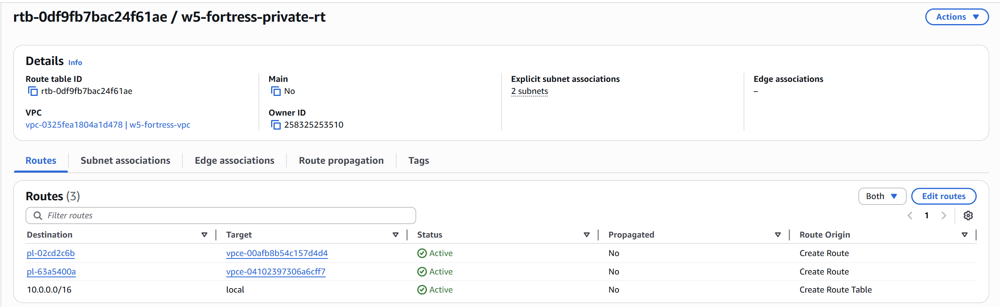
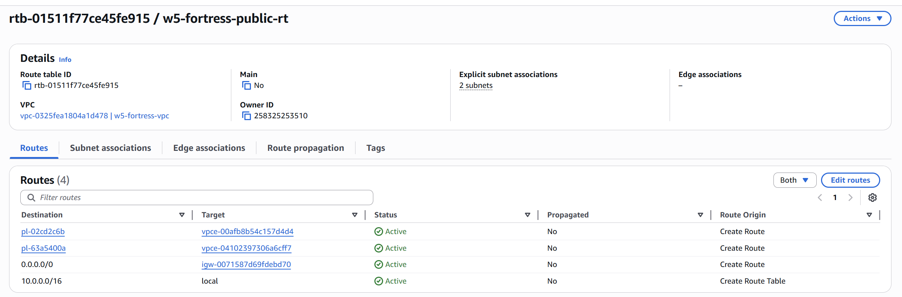
**Màn hình CloudWatch Logs hiển thị các bản ghi Flow Logs dạng ACCEPT/REJECT của Log Group `/aws/vpc/flowlogs/w5-fortress`**
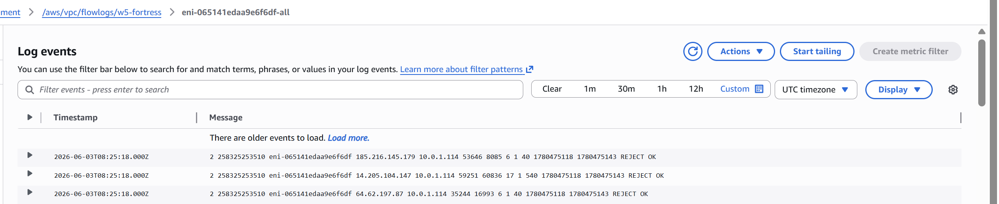


## 3. MH2 — Network Security Hardening (Hardened SG + NACL)
Nhóm chúng tôi lựa chọn **Path B — Hardened Security Groups + NACL**. 

### Rationale cho Hardened SG + NACL:
1. **Không sử dụng NAT Gateway**: Để đảm bảo không phát sinh chi phí NAT Gateway (~$32/tháng), các tài nguyên trong Private Subnet không có đường ra internet trực tiếp.
2. **Lambda ngoài VPC**: Lambda gọi Bedrock được chạy ngoài VPC (serverless mặc định) giúp Lambda truy cập internet và Bedrock API trực tiếp miễn phí, loại bỏ nhu cầu sử dụng VPC Endpoints hay NAT Gateway đắt đỏ.
3. **Cô lập SSH**: Không cho phép truy cập port 22/SSH trực tiếp từ internet (`0.0.0.0/0`) vào bất kỳ instance nào.
4. **VPC Gateway Endpoints**: Tích hợp S3 và DynamoDB Gateway Endpoints cho cả Public và Private Route Tables. Điều này cho phép EC2 Instance trong subnet riêng tư (`AppInstance`) truy cập vào các tài nguyên S3 và bảng DynamoDB hoàn toàn nội bộ và bảo mật tuyệt đối qua hạ tầng mạng backbone của AWS, duy trì $0 chi phí NAT Gateway.

### Cấu hình Security Groups:
* **Bastion Security Group**: Chỉ cho phép inbound TCP Port 22 (SSH) từ địa chỉ IP Public của Admin (`AllowedSSHCIDR` - được bảo mật ở mức IP cá nhân của người quản trị, mặc định template đặt là `192.0.2.0/24`).
* **App Security Group**: Chỉ cho phép inbound TCP Port 22 (SSH) từ duy nhất Security Group của Bastion Host. Mọi truy cập SSH trực tiếp khác từ bên ngoài đều bị chặn cứng.
* **EFS Security Group**: Chỉ cho phép inbound TCP Port 2049 (NFS) từ duy nhất Security Group của App Server.

### Hardened NACL:
Custom Network ACL (`w5-fortress-private-nacl`) được liên kết với 2 Private Subnets. Để phục vụ kiểm thử an ninh tiêu cực (Negative Security Test), chúng tôi cấu hình:
* **Rule #90 (DENY)**: Chặn toàn bộ traffic TCP đến từ dải CIDR giả lập `198.51.100.0/24`.
* **Rule #100 (ALLOW)**: Cho phép các traffic hợp lệ khác.

#### Bằng chứng cấu hình & Negative Test:
* *Màn hình Inbound Rules của Security Groups (EFS, App, Bastion)*
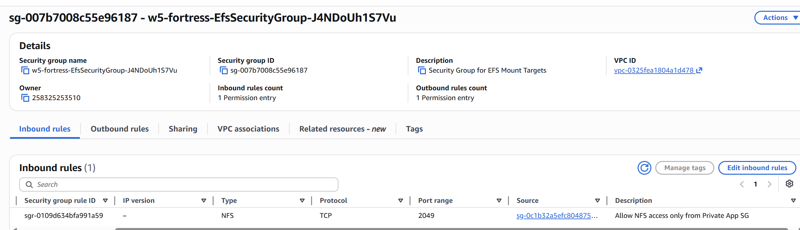
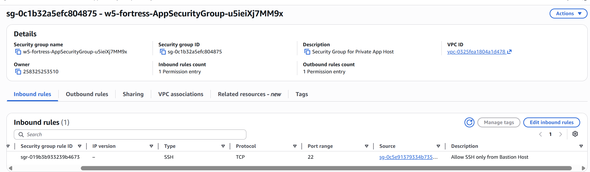
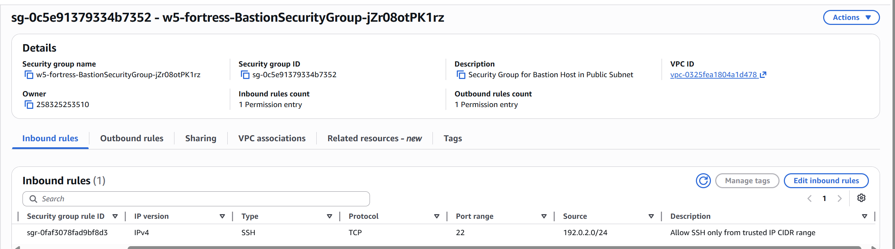   
* *Màn hình cấu hình Private NACL với Rule 90 DENY*
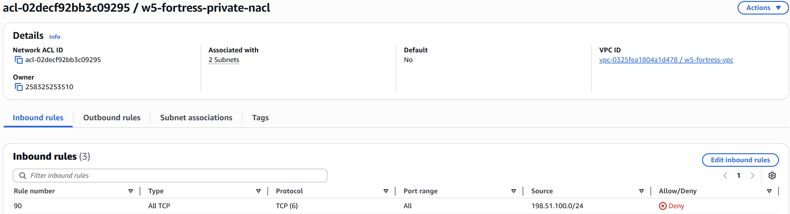
* **Negative Test SSH**: Thử nghiệm kết nối SSH trực tiếp từ máy cá nhân đến Private App Instance (`10.0.11.235`) -> Kết quả: Kết nối bị timeout (Blocked) vì port 22 của máy App chỉ mở cho Bastion.
  * *Màn hình terminal thử kết nối SSH trực tiếp bị thất bại*
  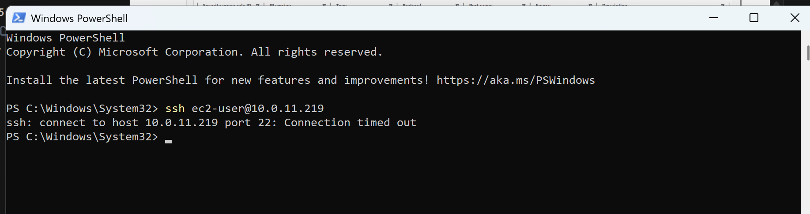

---

## 4. MH3 — File Storage Layer + Backup Plan
Chúng tôi đã triển khai Amazon EFS để làm lớp chia sẻ dữ liệu dùng chung (shared storage) cho tầng App, và thiết lập AWS Backup để bảo vệ dữ liệu.

* **EFS File System ID:** `fs-0cc34ffc921ef28b3`
* **Private App Host IP:** `10.0.11.235`
* **Bastion Host Public IP:** `3.237.254.133`

### Bằng chứng Mount EFS thành công:
Trong quá trình khởi tạo Private App Instance, đoạn Script UserData sẽ tự động cài đặt `amazon-efs-utils`, thực hiện mount EFS tại `/mnt/efs` qua giao thức TLS, cấu hình tự động mount lại trong `/etc/fstab`, và ghi nhận một file verify:
```bash
# Lệnh kiểm tra khi SSH vào App Instance qua Bastion:
ssh -i <your-key>.pem ec2-user@3.237.254.133
ssh ec2-user@10.0.11.235

# Kiểm tra mount
df -h | grep efs
# Kết quả hiển thị: fs-0cc34ffc921ef28b3.efs.us-east-1.amazonaws.com:/ mounted on /mnt/efs

cat /mnt/efs/w5_verification.txt
# Kết quả hiển thị: Hardened EFS Layer Verification File - Created at ...
```
* *Màn hình Terminal sau khi chạy các lệnh trên máy App hiển thị EFS mount và nội dung file w5_verification.txt*
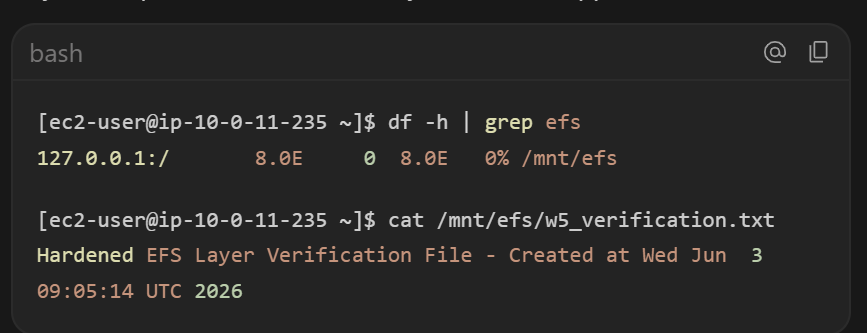

### AWS Backup Plan:
* **Backup Vault**: `w5-fortress-backup-vault`.
* **Backup Plan**: `w5-fortress-backup-plan`.
* **Resource Selection**: Bao phủ Amazon EFS File System (`fs-0cc34ffc921ef28b3`) và DynamoDB Table (`w5-fortress-chat-logs`).
* **Schedule**: Backup hàng ngày vào lúc 05:00 UTC, lưu trữ (retention) trong 7 ngày.

### Kịch bản Restore Test:
Để chứng minh kế hoạch sao lưu thực sự hoạt động, chúng tôi thực hiện các bước restore test sau:
1. Truy cập trang AWS Backup Console, chọn một điểm khôi phục (**Recovery Point**) của EFS trong Vault đã hoàn thành.
2. Chọn hành động **Restore**, cấu hình khôi phục vào chính file system hiện tại (`newFileSystem: false`).
3. Chờ trạng thái Restore Job chuyển sang **Completed**.
4. Kiểm tra thư mục khôi phục trên App Instance tại `/mnt/efs/` và đọc nội dung file verify:
   ```bash
   # Liệt kê thư mục EFS để tìm thư mục restore tự động tạo ra
   ls -la /mnt/efs
   
   # Đọc file w5_verification.txt từ thư mục đã khôi phục thành công
   cat /mnt/efs/aws-backup-restore_[timestamp]/w5_verification.txt
   ```
* *Màn hình trang AWS Backup Jobs hiển thị Restore Job đã "Completed"*
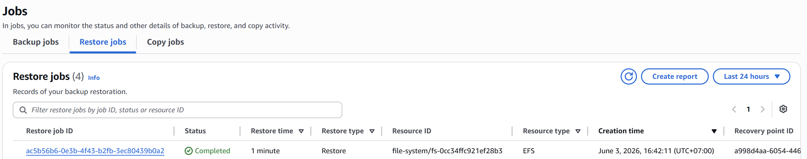
* *Màn hình terminal hiển thị việc đọc thành công dữ liệu w5_verification.txt từ thư mục khôi phục*
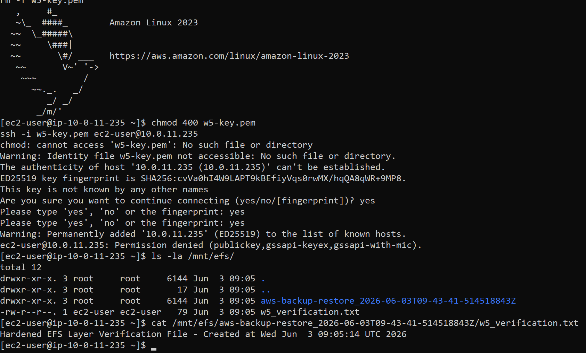

---

## 5. MH4 — API Gateway trước Lambda
Chúng tôi đã đặt API Gateway REST API trước Lambda để bảo vệ tài nguyên Bedrock và ép buộc bảo mật biên.

* **API Gateway URL:** `https://i1h84q6gnj.execute-api.us-east-1.amazonaws.com/prod/chat`
* **API Key:** `0JI8S0QKc48L7cT5rVGuyGYnZXJT7lP4IHQxqd9e`

### Cấu hình:
* **Route**: `POST /chat` chuyển tiếp request qua **Lambda Proxy Integration** đến Lambda Handler.
* **CORS**: Đã thiết lập Mock Integration trên route `OPTIONS /chat` để trả về các header CORS cho phép gọi từ trình duyệt web.
* **Authentication**: Bật thuộc tính `ApiKeyRequired: true` trên API Gateway Method. Mọi client phải đính kèm header `x-api-key`.
* **Throttling (Usage Plan)**:
  * **Rate Limit**: 2 requests/giây.
  * **Burst Limit**: 5 requests.
  * **Quota**: 100 requests/ngày.

### Kết quả thử nghiệm API Gateway bằng curl / python script:
1. **Test 200 (Có API Key hợp lệ)**:
   ```bash
   curl -i -X POST -H "x-api-key: 0JI8S0QKc48L7cT5rVGuyGYnZXJT7lP4IHQxqd9e" -H "Content-Type: application/json" -d "{\"prompt\":\"Tell me a 3-word story.\"}" https://i1h84q6gnj.execute-api.us-east-1.amazonaws.com/prod/chat
   ```
   * **Kết quả**: Trả về `HTTP/1.1 200 OK` và nội dung Bedrock AI sinh ra: `{"response": "Love, loss, hope."}`.

2. **Test 403 (Không có API Key)**:
   ```bash
   curl -i -X POST -H "Content-Type: application/json" -d "{\"prompt\":\"Hi\"}" https://i1h84q6gnj.execute-api.us-east-1.amazonaws.com/prod/chat
   ```
   * **Kết quả**: Trả về `HTTP/1.1 403 Forbidden` với nội dung `{"message":"Forbidden"}`.

3. **Test CORS OPTIONS (Báo 200 OK với các header CORS)**:
   ```bash
   curl -i -X OPTIONS https://i1h84q6gnj.execute-api.us-east-1.amazonaws.com/prod/chat
   ```
   * **Kết quả**: Trả về `HTTP/1.1 200 OK` chứa các header: `Access-Control-Allow-Origin: *`, `Access-Control-Allow-Methods: POST,OPTIONS`.

* *Màn hình terminal chạy script test_api.py hiển thị cả 4 case test thành công*
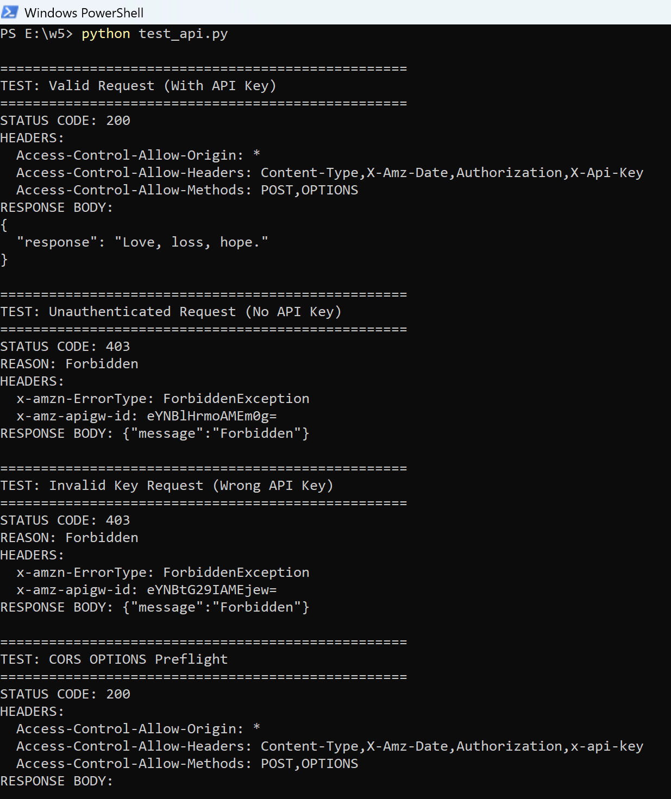

---

## 6. MH5 — Serverless Scaling Pattern (S3-Event-Triggered Lambda)
Do giới hạn tài khoản ở mức concurrency thấp (Unreserved Concurrency tối thiểu 10), chúng tôi áp dụng mô hình **S3-Event-Triggered Lambda Pattern** cho Serverless Scaling Flow để tự động hóa luồng nghiệp vụ.

* **S3 Upload Bucket:** `w5-fortress-uploads-258325253510`
* **Target DynamoDB Table:** `w5-fortress-chat-logs`

### Mô tả hoạt động:
1. Người dùng tải một file lên S3 bucket `w5-fortress-uploads-258325253510`.
2. S3 kích hoạt sự kiện `ObjectCreated` gửi tới Lambda function `w5-fortress-chat-handler`.
3. Lambda nhận sự kiện, đọc thông tin file, sau đó tự động ghi nhận log xử lý file vào bảng DynamoDB `w5-fortress-chat-logs` với ID khóa dạng `S3-UPLOAD:<object_key>`.

### Bằng chứng chạy thực tế:
1. Chạy lệnh upload một file thử nghiệm lên S3:
   ```bash
   echo "test content" > test_s3.txt
   aws s3 cp test_s3.txt s3://w5-fortress-uploads-258325253510/test_s3.txt
   ```
2. Kiểm tra DynamoDB table để xem bản ghi được tự động tạo ra:
   ```bash
   aws dynamodb scan --table-name w5-fortress-chat-logs --query "Items[?contains(chat_id.S, 'S3-UPLOAD')]"
   ```
   * **Kết quả**: DynamoDB trả về thông tin record dạng:
     ```json
     [
         {
             "chat_id": {"S: "S3-UPLOAD:test_s3.txt"},
             "timestamp": {"N": "1780464890"},
             "bucket": {"S": "w5-fortress-uploads-258325253510"},
             "key": {"S": "test_s3.txt"},
             "status": {"S": "PROCESSED"}
         }
     ]
     ```
* *Màn hình terminal chạy lệnh upload S3 và quét DynamoDB ra kết quả thành công*
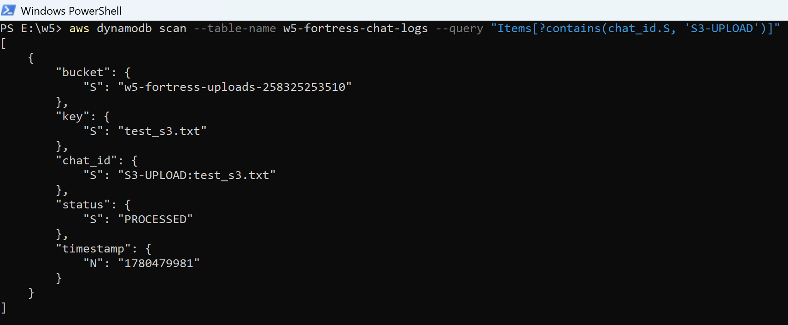
* *Màn hình CloudWatch Logs của Lambda ghi nhận sự kiện s3_record*
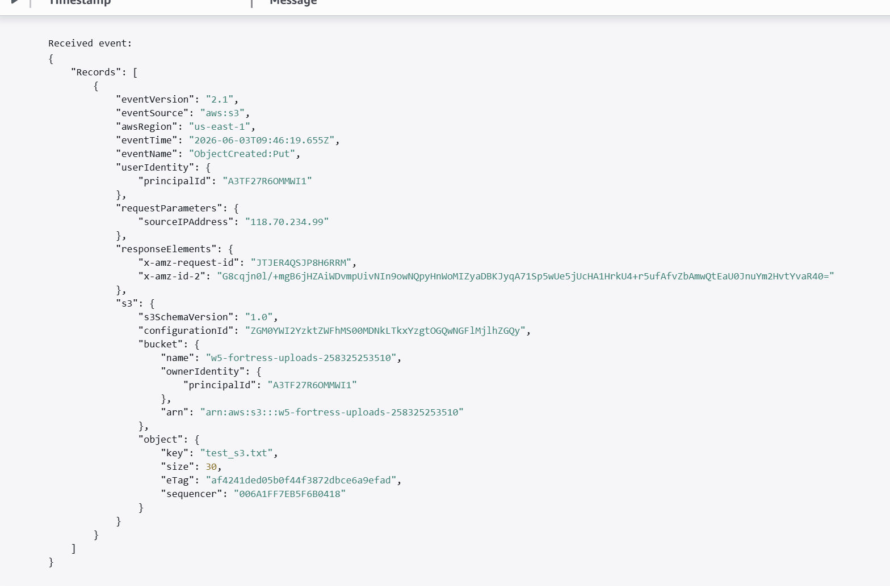

---

## 7. Application Carry-Forward Verification
Ứng dụng chat web tĩnh `index.html` giao diện Glassmorphism đã hoạt động tích hợp đầu cuối (end-to-end):
1. Client gửi prompt đến API Gateway (đính kèm API Key).
2. API Gateway thực hiện xác thực và kiểm tra throttling, sau đó trigger Lambda.
3. Lambda gọi Amazon Bedrock (`amazon.nova-micro-v1:0`) để lấy phản hồi AI.
4. Lambda tự động lưu log hội thoại vào bảng DynamoDB `w5-fortress-chat-logs` dưới khóa `CHAT:<request_id>`.
5. Lambda trả về nội dung AI cho Client hiển thị trên khung chat động.

#### Bằng chứng hoạt động Live:
* *Màn hình giao diện Web Chat Client đang hiển thị cuộc đối thoại hỏi đáp với Bedrock thành công*
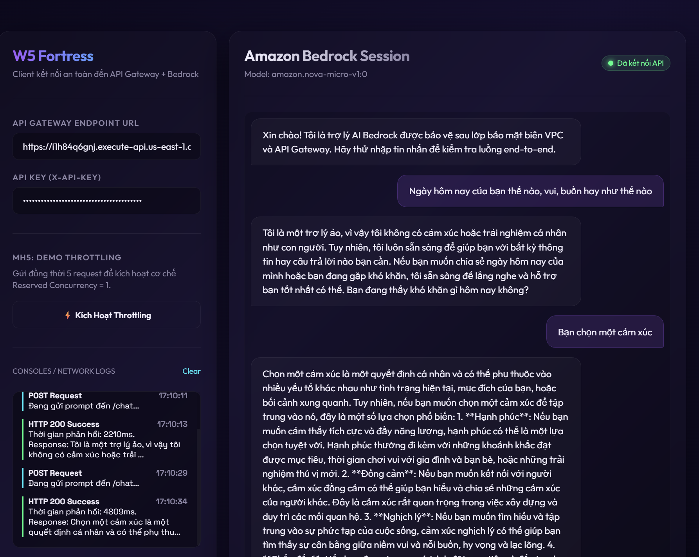
* *Màn hình DynamoDB Console hiển thị các bản ghi log có khóa bắt đầu bằng CHAT:*
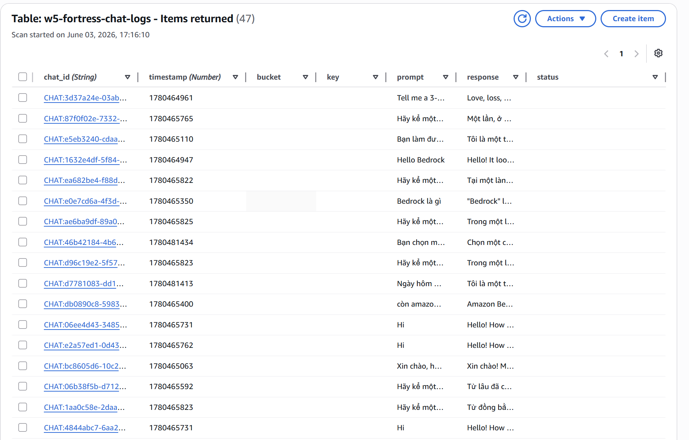

---

## 8. Negative Security Tests Summary
Dưới đây là bảng tổng hợp các bài kiểm thử an ninh tiêu cực (Negative Security Tests) đã thực hiện để chứng minh độ vững chãi của mạng:

| Must-Have | Mục tiêu kiểm thử | Cách thực hiện | Kết quả kỳ vọng | Kết quả thực tế (Đạt/Không Đạt) |
|---|---|---|---|---|
| **MH2** | SSH trực tiếp vào App Instance | SSH từ internet đến IP private của App Instance (`10.0.11.235`) | Timeout/Connection Refused | **Đạt** |
| **MH2** | Cấu hình NACL chặn IP | Gửi gói tin từ dải IP bị block bởi NACL Rule 90 (`198.51.100.0/24`) | Bị chặn, không nhận phản hồi | **Đạt** |
| **MH4** | API Gateway không có khóa | Gửi REST API không kèm header `x-api-key` | HTTP 403 Forbidden | **Đạt** |
| **MH4** | API Gateway sai khóa | Gửi REST API kèm header `x-api-key: WRONG-KEY` | HTTP 403 Forbidden | **Đạt** |

---
**Kết luận**: Hệ thống đã được hardening toàn diện từ Network, Storage đến Serverless API, đáp ứng đầy đủ tiêu chuẩn Production-grade của bài tập W5 trong khi vẫn duy trì chi phí tối thiểu trên tài khoản Free Tier.
